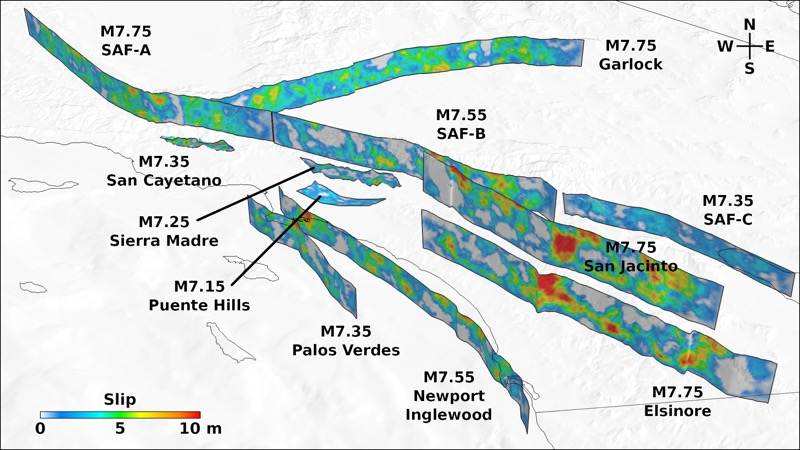
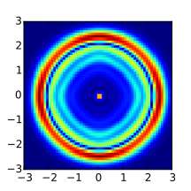
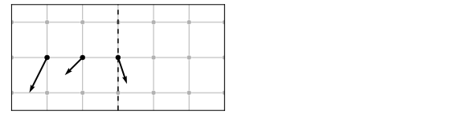
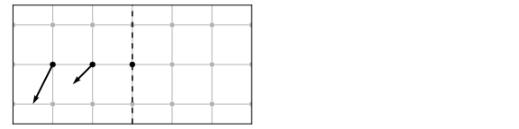
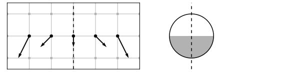
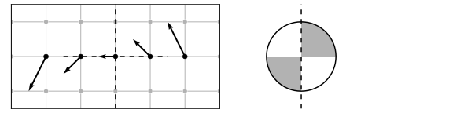
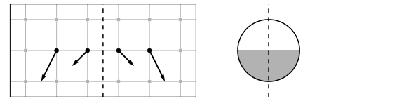
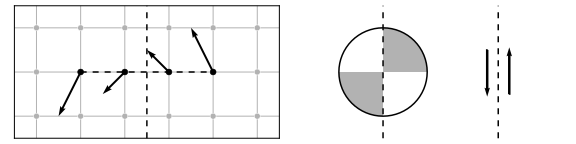

# COSEIS

# Computational Seismology Tools

[github.com/gely/coseis](https://github.com/gely/coseis/)  
[elygeo.net/coseis](http://elygeo.net/coseis/)  

## Summary

Coseis is a toolkit for earthquake simulation featuring:

- The Support Operator Rupture Dynamics ([SORD](#sord)) code for modeling
  spontaneous rupture and 3D wave propagation.

- SCEC Community Velocity Models (CVM) codes, with MPI parallelization for
  [Magistrale version](https://scec.usc.edu/scecpedia/CVM-S4) (CVM-S), and new
  [geotechnical layer implementation](http://elygeo.net/2016-Vs30GTL-Ely+4.html)
  for the [Harvard version](http://scec.usc.edu/scecpedia/CVM-H) (CVM-H).

- Utilities for mesh generation, coordinate projection, and visualization.

The primary interface is through a Python module which (for high-performance
components) wraps Fortran parallelized with hybrid OpenMP and MPI.

Coseis is written by [Geoffrey Ely](http://elygeo.net/) with contributions from
Steven Day, Bernard Minster, Feng Wang, Zheqiang Shi, and Jun Zhou.  It is
licensed under [BSD](http://opensource.org/licenses/BSD-2-Clause) terms.

**NOTICE**: Coseis is currently only lightly maintained.  You likely will need
to dig in, understand the code, and fix things to use it.  If you have (or know
of) means to support planned improvements or custom requirements, please be in
touch.

## Install MacOS Dependencies

Install [Xcode](http://itunes.apple.com/us/app/xcode/id497799835) from the App
Store followed by the Xcode the Command Line Tools with:

    xcode-select --install

Install [Homebrew](http://brew.sh/) and use it to install GCC (for Fortran),
Python:

    brew install gcc python3 

For analyisis and graphics also install VTK and usueful Python libs:

    brew install vtk
    python -m pip install mayavi matplotlib pyproj obspy

## Install Coseis

Clone the source code from the [Coseis GitHub
repository](http://github.com/gely/coseis):

    git clone git://github.com/gely/coseis.git

Setup python to be able to find the `cst` package:

    cd coseis
    python -m cst.setup

## Test

To run the test suite interactively:

    cd tests
    python test_runner.py --run=exec

Or, submit a job for batch processing:

    python test_runner.py --run=submit

After completion, a report is printed to the screen (or saved in
`run/test_suite/test_suite.output`):

    PASSED: cst.tests.hello_mpi.test()
    PASSED: cst.tests.point_source.test()
    PASSED: cst.tests.pml_boundary.test()
    PASSED: cst.tests.kostrov.test()

## SORD

The Support Operator Rupture Dynamics (SORD) code simulates spontaneous rupture
within a 3D isotropic viscoelastic solid. Wave motions are computed on a
logically rectangular hexahedral mesh, using the generalized finite difference
method of support operators. Stiffness and viscous hourglass corrections are
employed to suppress suppress zero-energy grid oscillation modes. The fault
surface is modeled by coupled double nodes, where the strength of the coupling
is determined by a linear slip-weakening friction law. External boundaries may
be reflective or absorbing, where absorbing boundaries are handled using the
method of perfectly matched layers (PML). The hexahedral mesh can accommodate
non-planar ruptures and surface topography

SORD simulations are configured with Python scripts. Underlying computations
are coded in Fortran 95 and parallelized for multi-processor execution using
Message Passing Interface (MPI) and OpenMP. The code is portable and tested
with a variety of Fortran 95 compilers, MPI implementations, and UNIX-like
operating systems (Linux, MacOS, IBM AIX, etc.).

## Background

The formulation, numerical algorithm, and verification of the SORD method are
described by @2008-GJI-Ely+2 for wave propagation, and @2009-GJI-Ely+2 for
spontaneous rupture. @2010-BSSA-Ely+2 present an application to simulating
earthquakes in southern California.

## User Guide

### Quick test

Run a simple point source explosion test and plot a 2D slice of particle
velocity:

    cd scripts
    python SORD-Example-sim.py
    python SORD-Example-ploy.py

Plotting requires Matplotlib, and the result should look like this:

### Python Scripting

The general procedure is to import the `cst` module, create a dictionary of
parameters, and pass that dictionary to the `cst.sord.run()` function.
Parameters are either job-control or simulation parameters. Defaults for these
two types of parameters are given in [cst.job.defaults](cst/job.py) and
[cst.sord.parameters](cst/sord.py), respectively. Machine specific job-control
parameters may also be present in the `conf` directory that supersede the
defaults.

It maybe be helpful to look through example applications in the
`scripts` directory, and return to this document for further description
of the simulation parameters.

### Field I/O

[Note about a change from previous versions: The `fieldio` parameter has been
removed, and instead each field I/O parameter is a separate list.]

Multi-dimensional field arrays may be accessed for input and out through a list
of operations that includes reading from and writing to disk, as well as
assigning to scalar values or time-dependent functions. In the quick test
above, `rho`, `vp`, `vs`, `v1`, and `v2` are examples of 3- and 4-D fields. The
full list of available fields is given in the
[cst.sord.fieldnames](cst/sord.py) dictionary.

Field variables are categorized in four ways: (1) static vs. dynamic, (2)
settable vs. output only, (3) node vs. cell registration, and (4) volume vs.
fault surface. For example, density `rho` is a static, settable, cell, volume
variable. Slip path length `sl` is a dynamic, output, node, fault variable.

Field operations may specify a subregion of the array by giving slicing indices
for each dimension. The 0-based indices can be either, a single index, empty
brackets `[]` as shorthand for the entire array, of arguments to the python
`slice()` function, which can be either [start], [start, stop] or [start, stop,
step]. Here are some examples:

    [10, 20, 1, []]             # Single cell, full time history
    [10, 20, 1, -1]             # Single node, last time step
    [[], [], [], -1]            # Full 3D volume, last time step
    [10, [], [], [0, None, 10]] # j=10 node surface, every 10th time step

FIXME: this section is unfinished.

    f = val                         # Set f to value
    f = ([], '=', val)              # Set f slice to value
    f = ([], '+', val)              # Add value to f slice
    f = ([], '=', 'rand', val)      # Random numbers in range (0, val)
    f = ([], '=', 'func', val, tau) # Time function with period tau, scaled by val
    f = ([], '<=', 'filename')      # Read filename into f
    f = ([], '=>', 'filename')      # Write f into filename

A dot (`.`) indicates sub-cell positioning via weighted averaging. In this case
the spatial indices are single logical coordinates that may vary continuously
over the range. The fractional part of the index determines the weights. For
example, an index of 3.2 to the 1D variable f would specify the weighted
average: 0.8 \* f(3) + 0.2 \* f(4).

Reading and writing to disk uses flat binary files where j is the fastest
changing index, and t is the slowest changing index. Mode 'R' extrapolates any
singleton dimensions to fill the entire array. This is useful for reading 1D or
2D models into 3D simulations, obviating the need to store (possibly very
large) 3D material and mesh coordinate files.

For a list of available time functions, see the `time_function` subroutine in
[util.f90](cst/sord/util.f90). The routine can be easily modified to add new
time functions. Time functions can be offset in time with the `tm0` initial
time parameter.

### Boundary Conditions

Boundary conditions for the six faces of the model domain are specified by the
parameters `bc1` (near-size, x, y, and z faces) and `bc2` (far-side, x, y, and
x faces). The symmetry boundary conditions can be used to reduce computations
for problems where they are applicable. These are not used for specifying
internal slip boundaries. However, for problems with symmetry across a slip
surface, the fault may be placed at the boundary and combined with an
anti-mirror symmetry condition. The following BC types are supported:

`free`: Vacuum free-surface. Stress is zero in cells outside the boundary.

`rigid`: Rigid surface. Displacement is zero at the boundary.

`+node`: Mirror symmetry at the node. Normal displacement is zero at the
boundary. Useful for a boundary corresponding to (a) the plane orthogonal to
the two nodal planes of a double-couple point source, (b) the plane normal to
the mode-III axis of a symmetric rupture, or (c) the zero-width axis of a 2D
plane strain problem.

`-node`: Anti-mirror symmetry at the node. Tangential displacement is zero
at the boundary. Useful for a boundary corresponding to (a) the nodal planes of
a double-couple point source, (b) the plane normal to the mode-II axis of a
symmetric rupture, or (c) the zero-width axis of a 2D antiplane strain problem.

`+cell`: Mirror symmetry at the cell. Same as type 1, but centered on the cell.

`-cell`: Anti-mirror symmetry at the cell. Same as type -1, but centered on the
cell. Can additionally be used when the boundary corresponds to the slip
surface of a symmetric rupture.

`pml`: Perfectly match layer (PML) absorbing boundary.

Example: a 3D problem with a free surface at Z=0, and PML absorbing boundaries
on all other boundary faces:

    shape = [50, 50, 50, 100]
    bc1 = ['pml', 'pml', 'free']
    bc2 = ['pml', 'pml', 'pml']

Example: a 2D antiplane strain problem with PML absorbing boundaries. The
number of nodes is 2 for the zero-width axis:

    shape = [50, 50, 2, 100]
    bc1 = ['pml', 'pml', '-node']
    bc2 = ['pml', 'pml', '-node']

### Defining the fault rupture surface

Fault rupture always follows a surface of the (possibly non-planar) logical
mesh. The orientation of the fault plane is defined by the `faultnormal`
parameter. This can be either 1, 2, or 3 corresponding to surfaces normal to
the j, k, or l logical mesh directions. Any other value (typically 0) disables
rupture altogether. The location of the rupture plane with in the mesh is
determined by the `ihypo` parameter, which has a dual purpose of also defining
the nucleation point. So, the indices of the collocated fault double nodes are
given by `int(ihypo[faultnormal])`, and `int(ihypo[faultnormal]) + 1`. For
example, a 3D problem of dimensions 200.0 x 200.0 x 200.0, with a fault plane
located at z = 100.0, and double nodes at l = (21, 22), may be set up as such:

    delta = [5.0, 5.0, 5.0, 0.1]
    faultnormal = 3
    shape = [41, 41, 42, 100]
    hypocenter = [20.0, 20.0, 20.5]
    bc1 = ['free', 'free', 'free']
    bc2 = ['free', 'free', 'free']

For problems with symmetry across the rupture surface (where mesh and material
properties are mirror images), the symmetry may be exploited for computational
savings by using an appropriate boundary condition and solving the elastic
equations for only one side of the fault. In this case, the fault double nodes
must lie at the model boundary, and the and the cell-centered anti-mirror
symmetry condition used. For example, reducing the size of the previous example
to put the rupture surface along the far z boundary:

    shape = [41, 41, 22, 100]
    hypocenter = [20.0, 20.0, 20.5]
    bc1 = ['free', 'free', 'free']
    bc2 = ['free', 'free', '-cell']

Alternatively, put the rupture surface along the near z boundary:

    shape = [41, 41, 22, 100]
    hypocenter = [20.0, 20.0, 1.5]
    bc1 = ['free', 'free', '-cell']
    bc2 = ['free', 'free', 'free']

Further symmetries may present. If our previous problem has slip only in the x
direction, then we may also use node-centered mirror symmetry along the
in-plane axis, and node-centered anti-mirror symmetry along the anti-plane
axis, to reduce computations eight-fold:

    shape = [21, 21, 22, 100]
    hypocenter = [20.0, 20.0, 20.5]
    bc1 = ['free', 'free', 'free']
    bc2 = ['anti-n', 'mirror-n', 'anti-c'

## Memory Usage and Scaling

23 single precision (four-byte) memory variables are required per mesh point.
On current hardware, computation time is on the order of the one second per
time step per one million mesh points. SORD scalability has been benchmarked up
to 64 thousand processors at ALCF.

: **Figure.** Weak-scaling benchmarks.

## References {.bib}

