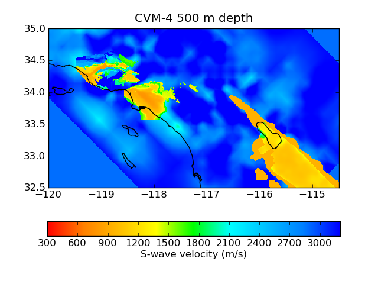
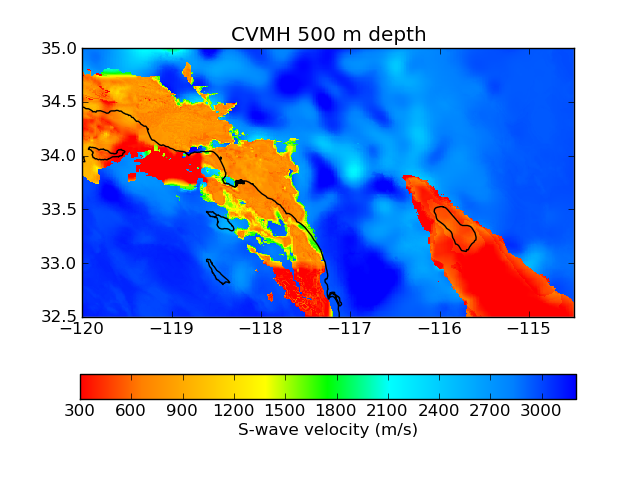
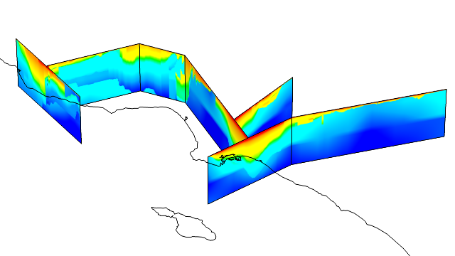

======
Coseis
======
Computational Seismology Tools
~~~~~~~~~~~~~~~~~~~~~~~~~~~~~~

.. class:: navbar

+ Install_
+ Examples_
+ SORD_
+ WebSims_
+ `Source Code`_

.. _SORD:         sord.html
.. _WebSims:      http://scec.usc.edu/websims
.. _Source Code:  http://github.com/gely/coseis/

Summary
=======

Coseis is an open-source toolkit for earthquake simulation featuring:

*   The Support Operator Rupture Dynamics (SORD_) code for modeling spontaneous
    rupture and 3D wave propagation.

*   SCEC Community Velocity Models (CVM) codes, with MPI parallelization for
    `version 4`__, and new `geotechnical layer implementation`__ for the
    `Harvard version`__.

*   WebSims_ web application for cataloging, exploring, and disseminating large
    numerical simulations data sets.

*   Utilities for mesh generation, coordinate projection, and visualization.

__ http://www.data.scec.org/3Dvelocity/
__ http://earth.usc.edu/~gely/cvmh/
__ http://structure.harvard.edu/cvm-h/

The primary interface is through a Python module which (for high-performance
components) wraps Fortran parallelized with MPI.

Coseis is written by `Geoffrey Ely`_ with contributions from Steven Day,
Bernard Minster, Feng Wang, Zheqiang Shi, and Jun Zhou.  It is licensed under
GPLv3_.

.. _Geoffrey Ely: http://earth.usc.edu/~gely/
.. _GPLv3:        http://www.gnu.org/licenses/gpl-3.0.html

.. class:: warning

    **WARNING**: Coseis is a research code under active development.  Changes
    are frequent and it has known bugs!

System requirements
===================

*   Python_, and NumPy_ (Numerical Python).

*   (+) Fortran 95 compiler.  Required only for SORD and CVM4 modules.

*   (+) Message Passing Interface (MPI) library.  Required only for
    multiprocessing with SORD and CVM4.

*   (+) Matplotlib_, SciPy_, and Pyproj Python packages.  Required only for
    supplemental plotting, signal processing, and mesh generation utilities.

*   (+) Git_ version control system.  Useful for development and staying updated
    with the latest code version.

(+) Optional

Install
=======

Fortran and MPI installation should only be necessary for personal computers.
HPC systems generally supply specifically tuned Fortran compilers and MPI
libraries.

1.  GNU Fortran is recommended if you don't already have a Fortran 95 compiler.

    Fedora/Red Hat Linux:
    ::

        sudo yum install gfortran

    Ubuntu Linux:
    ::

        sudo apt-get install gfortran

    Mac OS X:

GNU Fortran versions from MacPorts and Fink are not recommended.  Instead,
download the latest gfortran package in the *Apple Xcode gcc-42 add-ons*
section of the `R for Mac OS X`_ Developer's Page along with and the
corresponding version of Xcode_ (either iPhone or Mac-only) available from
`Apple Developer`_ Connection (free membership required).  Install Xcode fir

2.  MPICH2_ is recommended if you need MPI.  The included script
    install-mpich.sh_ can install MPICH2 for you.

3.  It is recommended that you install a private copy of Python for Coseis.
    The included script install-python.sh_ can install Python and NumPy for you.
    Enthought Python Distribution (EPD_) is another option that includes many
    bells and whistles such as the Mayavi_ visualization package.

4.  Download the source code.  The best option is to use the `Coseis GitHub
    repository <http://github.com/gely/coseis>`__ with Git_ version control, which
    facilitates applying code updates, and merging local modifications::

        git clone git://github.com/gely/coseis.git

    Update to the latest changes anytime with:
    ::

        git pull

    Alternatively, download and unpack the source tar archive:
    ::

        curl http://earth.usc.edu/~gely/coseis/download/coseis.tgz | tar zx

5.  For laptop and workstation installations, the default system configuration
    is usually be adequate.  To test the default configuration::

        cd coseis/
        python setup.py

    Systems with batch schedulers (such as PBS or LoadLeveler) generally require
    custom configuration to specify system resources, compiler options, and
    scheduler scripts.  If Coseis has already been configured for your system you
    can use one of the included configurations.  For example, for the TeraGrid
    Ranger system at TACC::

        python setup.py --machine=tacc-ranger

    To see the list of included configurations look in the ``cst/conf/`` directory.
    Each custom configuration is located in a separate sub-directory.  To create a
    new custom configuration, make a new sub-directory following the example of
    the supplied configurations.

6.  Compile component codes:
    ::

        python setup.py build

7.  Configure the Python path:
    ::

        python setup.py path

8.  Steps 5 through 7 can be combined as:
    ::

        python setup.py --machine=tacc-ranger build path

.. _install-python.sh: ../util/install-python.sh
.. _install-mpich.sh:  ../util/install-mpich.sh
.. _Git:               http://git-scm.com/
.. _MPICH2:            http://www.mcs.anl.gov/research/projects/mpich2/
.. _Xcode:             http://developer.apple.com/technology/xcode.html
.. _Apple Developer:   http://connect.apple.com/
.. _R for Mac OS X:    http://r.research.att.com/tools/
.. _EPD:               http://www.enthought.com/products/epddownload.php
.. _Python:            http://www.python.org/
.. _NumPy:             http://numpy.scipy.org/
.. _SciPy:             http://www.scipy.org/
.. _Mayavi:            http://code.enthought.com/projects/mayavi/
.. _Matplotlib:        http://matplotlib.sourceforge.net/

Examples
========

CVM depth planes
----------------

Extract S-wave velocity at 500 meters depth. Plot using Matplotlib
::

    cd scripts/cvm
    python plane.py

Source code:
`plane.py <../scripts/cvm/plane.py>`__

CVM fence diagram
-----------------

Build a fence diagram similar to Magistrale (2000) figure 10. Plot using
Mayavi::

    cd scripts/cvm
    python fence.py

Source code:
`fence.py <../scripts/cvm/fence.py>`__

CVM-4 Basin depth
-----------------

.. image:: ../scripts/basindepth/cvm4-z25.png

Extract 3D mesh and search for the shallowest surface of Vs = 2.5 km/s.
Plot over topography using Mayavi::

    cd scripts/basindepth
    python mesh.py
    python search.py
    python viz.py

Source code:
`mesh.py <../scripts/basindepth/mesh.py>`__
`search.py <../scripts/basindepth/search.py>`__
`viz.py <../scripts/basindepth/viz.py>`__

